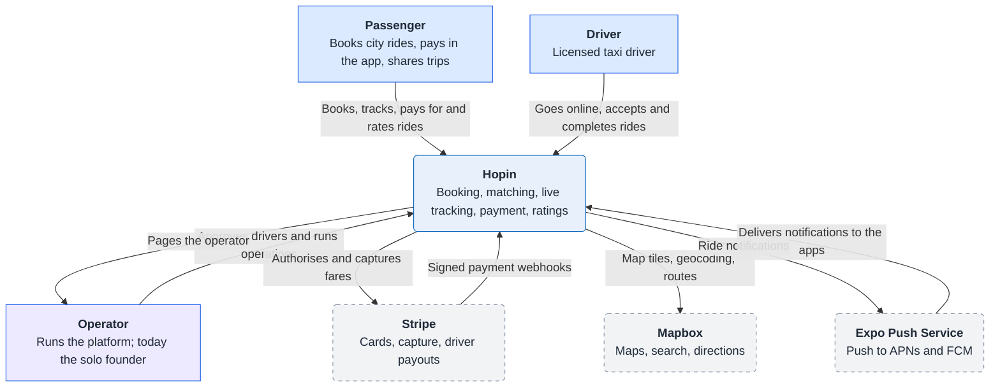
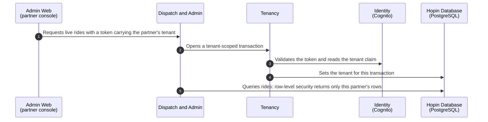
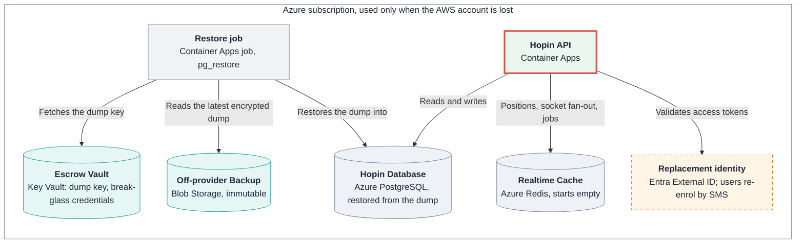
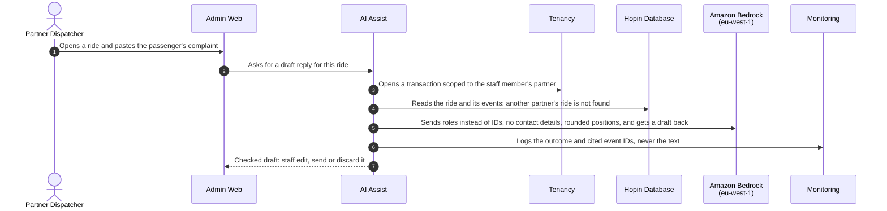

# Hopin — a reference architecture for regulated ride-hailing dispatch

*Hop in. Get there.*

**What this is:** an architecture case study, with one thin slice of running code for evidence. Short on time? Follow the [ten-minute review](#ten-minute-review). It designs a taxi dispatch platform for Hungary end to end, from statute text to deployment and disaster recovery, as a public portfolio of architecture work. **It is not a product and will not be operated.** Where the documents say "planned", read "designed, not built".

## Ten-minute review

For a hiring manager or reviewer with ten minutes, in this order:

| Minutes | Read | What it shows |
|---|---|---|
| 2 | [Executive summary](docs/executive-summary.md) | The recommendation, the numbers and the gates, on one page |
| 2 | [Design findings](docs/architecture/evidence/design-findings.md) | Twelve problems the process caught before production code, and what changed |
| 2 | [ADR 9: shared database with row-level security](docs/architecture/decisions/0009-hybrid-multi-tenancy.md) and its [diagram](#the-architecture-in-four-diagrams) | Tenant isolation enforced by the database, and when a partner gets a silo |
| 2 | [ADR 12: payment capture as a workflow named by the ride](docs/architecture/decisions/0012-payment-capture-workflow.md) | Exactly-once money movement without trusting the network |
| 2 | [ADR 1: AWS primary, Azure only for recovery](docs/architecture/decisions/0001-aws-primary-azure-for-off-provider-recovery.md) and the [recovery diagram](#the-architecture-in-four-diagrams) | A second cloud for the failure you actually fear, and the gap found by drawing it |

Then, if there is time: the [retrospective](docs/retrospective.md), what I would do differently and what is still weak.

## The problem

A white-label dispatch platform for licensed Hungarian taxi companies, plus a consumer brand on the same platform: passenger app (iOS, Android, web), driver app, a dispatch console for partner staff, and a backend on AWS with recovery on Azure.

What makes it hard is not the stack. It is the constraints:

- **Law decides the product.** Only licensed taxis with certified meters may drive. The payable fare is the meter amount at fixed official rates, so no upfront prices, discounts or surge. A Budapest dispatch operator needs 100 M HUF equity and BKK-certified software. See the [regulatory memo](docs/compliance/s002-regulatory-memo.md) and [constraints C-01 to C-09](docs/architecture/requirements/constraints.md).
- **Several companies share one system.** Partners must never see each other's data, yet share one app ([ADR 9](docs/architecture/decisions/0009-hybrid-multi-tenancy.md), [ADR 10](docs/architecture/decisions/0010-one-app-for-all-partners.md)).
- **Personal location data** under GDPR, with controller roles that depend on who holds the dispatch licence ([ADR 11](docs/architecture/decisions/0011-joint-controllers-with-partners.md)).
- **One operator.** Every design choice has to be runnable by a single person ([P-01](docs/architecture/principles/architecture-principles.md)).

## The architecture in four diagrams

Redrawn from the [Structurizr model](docs/architecture/workspace.dsl) for reading on GitHub. The model stays the source of truth, and each redraw is logged in the [presentation ledger](docs/architecture/presentation/README.md). The architecture PDF under [Releases](https://github.com/Dezoxy/hopin/releases) holds the overview, all fifteen ADRs, the design findings, the risk register and all 28 views in their checked layout.

**Who uses Hopin, and what it depends on.** Three user types and three outside services. Partner staff and the authorities have their own views.

<!-- Source: Context view, model commit dd0b063. Redrawn by hand; see docs/architecture/presentation/README.md -->


**How one partner's request stays inside that partner's data.** The database enforces isolation, not the application code ([ADR 9](docs/architecture/decisions/0009-hybrid-multi-tenancy.md)).

<!-- Source: PartnerIsolation view, model commit dd0b063. Redrawn by hand; see docs/architecture/presentation/README.md -->


**What runs on Azure after the AWS account is lost, and what is missing.** Drawing this view exposed the gap: Cognito cannot be exported, so every user re-enrols by SMS code ([ADR 1](docs/architecture/decisions/0001-aws-primary-azure-for-off-provider-recovery.md), [RISK-017](docs/architecture/risks/architecture-risks.md)).

<!-- Source: AccountRecovery view, model commit dd0b063. Redrawn by hand; see docs/architecture/presentation/README.md -->


**How a complaint becomes a draft reply that a human approves.** AI reads and drafts under the staff member's tenant; it never decides ([ADR 14](docs/architecture/decisions/0014-ai-assists-staff-read-and-draft-only.md), [ADR 15](docs/architecture/decisions/0015-bedrock-for-data-openrouter-for-evaluation.md)). This flow runs in the [slice](slice/README.md).

<!-- Source: DisputeAssist view, model commit dd0b063. Redrawn by hand; step 7 drawn as a reply. See docs/architecture/presentation/README.md -->


## Decisions worth reading

| Decision | The reusable rule it sets |
|---|---|
| [ADR 1: AWS primary, Azure only for recovery](docs/architecture/decisions/0001-aws-primary-azure-for-off-provider-recovery.md) | Use a second cloud for the failure you actually fear (losing the account), not for symmetry |
| [ADR 9: shared database with row-level security, dedicated on demand](docs/architecture/decisions/0009-hybrid-multi-tenancy.md) | Isolation is enforced by the database; a silo is sold, not defaulted |
| [ADR 10: one app, one partner per order](docs/architecture/decisions/0010-one-app-for-all-partners.md) | Never let the platform become the licensed party by accident |
| [ADR 11: joint controllers, pending legal review](docs/architecture/decisions/0011-joint-controllers-with-partners.md) | Controller roles follow the law, not the contract; leave it Proposed until counsel confirms |
| [ADR 12: payment capture as a workflow named by the ride](docs/architecture/decisions/0012-payment-capture-workflow.md) | Exactly-once effect comes from idempotency keys, not the network; naming the workflow after the ride also stops a second run from starting |
| [ADR 13: operator access by partner grant](docs/architecture/decisions/0013-operator-access-by-partner-grant.md) | The platform operator is not a super-user; the data owner grants access, briefly and on the record |
| [ADR 14: AI reads and drafts, humans decide](docs/architecture/decisions/0014-ai-assists-staff-read-and-draft-only.md) | Put AI where it saves writing, and keep it away from decisions about work and money; that choice also sets the AI Act risk class |
| [ADR 15: Bedrock for real data, OpenRouter for evaluation](docs/architecture/decisions/0015-bedrock-for-data-openrouter-for-evaluation.md) | Separate the playground from production in code, not in a policy document |

All fifteen ADRs, 28 model views and the reading paths per audience are in the [architecture README](docs/architecture/README.md). To present them, use the [talk tracks](docs/architecture/talks/talk-tracks.md) and the per-view [speaker notes](docs/architecture/talks/speaker-notes.md).

## Read by audience

- **Executive:** start with the one-page [executive summary](docs/executive-summary.md), then the [business case](docs/business/business-case.md), [three-year cost model](docs/business/three-year-cost-model.md), the Context view, the [risk register](docs/architecture/risks/architecture-risks.md).
- **Architect or CTO:** [quality attributes](docs/architecture/requirements/quality-attributes.md), [constraints](docs/architecture/requirements/constraints.md), the ADRs, the Security and deployment views.
- **Engineer:** the [architecture README](docs/architecture/README.md) engineer path, [integration](docs/architecture/integration/integration-architecture.md) and the [event catalog](docs/architecture/integration/event-catalog.md).
- **Operator:** [availability](docs/architecture/reliability/availability.md), [disaster recovery](docs/architecture/reliability/disaster-recovery.md), [observability](docs/architecture/observability/observability-architecture.md).

## Status and what comes next

The design is complete for the MVP scope. A thin running slice in [slice/](slice/README.md) measured the first quality attributes locally: a ride offer reaches a driver in 23 ms at p95, without the road-ETA call the law requires, which is not measured yet ([evidence](docs/architecture/evidence/s123-slice-results.md)). The build roadmap in the [plan](docs/hopin-plan.md) is frozen, and the portfolio track, plan Phase 12, is complete. Two things remain open by design:

- A recorded walkthrough, scripted in [track 4 of the talk tracks](docs/architecture/talks/talk-tracks.md#track-4-the-recorded-walkthrough).
- A review by a human architect. So far the decisions have one author and one [AI review](docs/retrospective.md#review-by-an-ai-critic).

## Repository layout

```text
.agents/skills/     agent skills (mirror of .claude/skills)
.claude/            Claude Code skills and ECC language rules
.github/workflows/  docs consistency and architecture PDF workflows
docs/               plan, architecture knowledge base, business case, compliance research
slice/              thin running slice of the API (NestJS, PostgreSQL, Redis), its load test, and an AI dispute assistant with an evaluation harness
scripts/            docs consistency check, architecture PDF tooling
AGENTS.md           agent instructions (identical to CLAUDE.md)
CLAUDE.md           agent instructions
Makefile            architecture model and docs commands (`make` lists them)
```

## Checks

```bash
make docs     # documentation consistency
make check    # Structurizr model validate + inspect (needs Docker)
```

Both run in CI on every pull request, alongside Markdown lint and secret scanning. The slice has its own tests (`cd slice && pnpm test`), a required check that runs its suite whenever `slice/` changes. `main` accepts changes only through pull requests.
